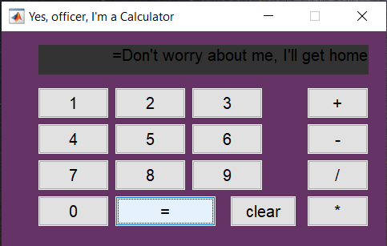

# Programming

These are some of the mini projects done which are related to the field of Computer Vision. Image detection, Object detection, Text extraction from image, etc are some of the projects done and the used Libraries are OpenCV, matpotlib and Numpy. Along with this, I have created simple Graphical User Interface (GUI) projects using Python and MATLAB. 

These libraries are used in the following projects:

- OpenCV

 ```bash
  pip install opencv-python
 ```
- Matplotlib
 ```bash
  pip install matplotlib
 ```
- Numpy
 ```bash
   pip install numpy
  ```


## A. Object Detection

In this task, a Car image with a license plate is given as input. 

### Steps involved: 

i. The Car image is displayed using "display function". Also, the image size and plotting is defined using this function.

ii. A Cascade Classifier is used to detect the object in the image. In this case, the license plate is the main object for detection.

iii. Next, a copy of the image is taken and is 'detectMultiScale' function is used. This function detects objects of different sizes in the given input image. The detected objects are returned as a list of rectangles.

iv. Using the cv2.rectangle function a rectangle box is drawn around the license plate of the image using the axis, height and width.

v. The required license plate is detected in the input image.


#### Note: 

Due to some issue the file is unable to load. It is solved with this link []

### B. Text Detection from image

The main goal is to detect text from a given image.

Used Modules for Extraction of the Image:
 
Once the text has been detected, bounding boxes are used to display the characters of the text individually as shown in the obtained result.


# GUI Projects

###  Simple GUI application of calculator using matlab
The code is presented in the MATLAB folder under the name "drunk_calculator.m"
This Calculator works as normal calculator when calculations are performed sequentially
Also this calculator have the capability to produce some wierd messages as displayed below. This happens when the buttons are pressed randomly.

   


#  PDFextractor 
 
It is an simple GUI app where the text can be extracted by uploading the desired pdf file.

The code is stored in the file 'PDFextractor.py'

These Libraries are used in the project

- tkinter - This library is used to create a graphic file. Different widgets like buttons, labels, Frame etc. are used in the project.

 ```bash
  pip install tk
 ```
- PyPDF2 - This library is used to perform several operations like splitting, merging, cropping etc on the uploaded pdf file.

 ```bash
  pip install PyPDF2
 ```
- PIL - Stands for Python imaging library, where it is supports opening, manipulating, saving different file formats.

 ```bash
  pip install Pillow
 ```
The ouptut of the program is attached as an image below along with the pdf file used in the program.


###  Login_System

This is a simple GUI app which makes allows the user to login into their account. The application consists of username password along with login and register options. The username and password will be created and stored in a text file for a new user. While on the other users, they can login with the details if their details are correct. If they are incorrect then the login will be prevented. 

It is built using Tkinter library where different widgets are used to control the application. Frmames, Labels, Entries, Canvas etc are some widgets which are used in this project. Also there are different functions present in the program to specify the operations being performed. 

- tkinter - This library is used to create a graphic file. Different widgets like buttons, labels, Frame etc. are used in the project.

 ```bash
  pip install tk
 ```

The code is stored in the file 'Login_System.py'

The ouptput of the code is shown as follows:

.png)  .png)


